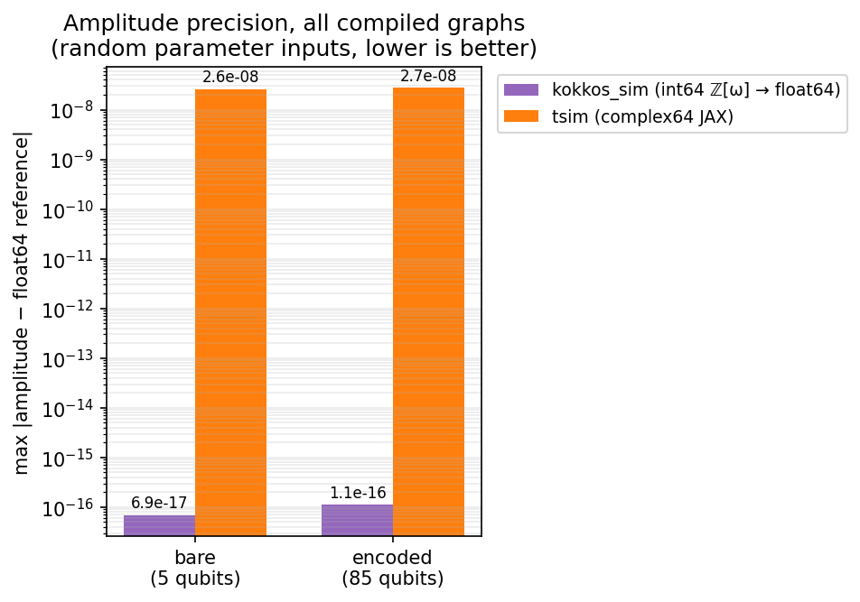
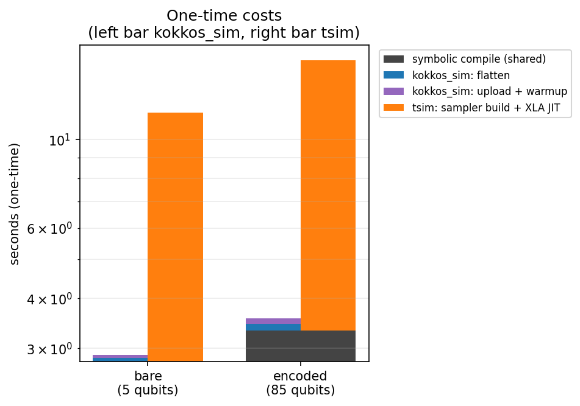
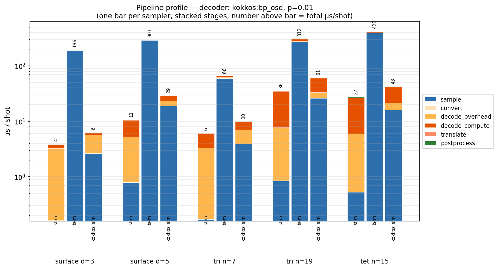
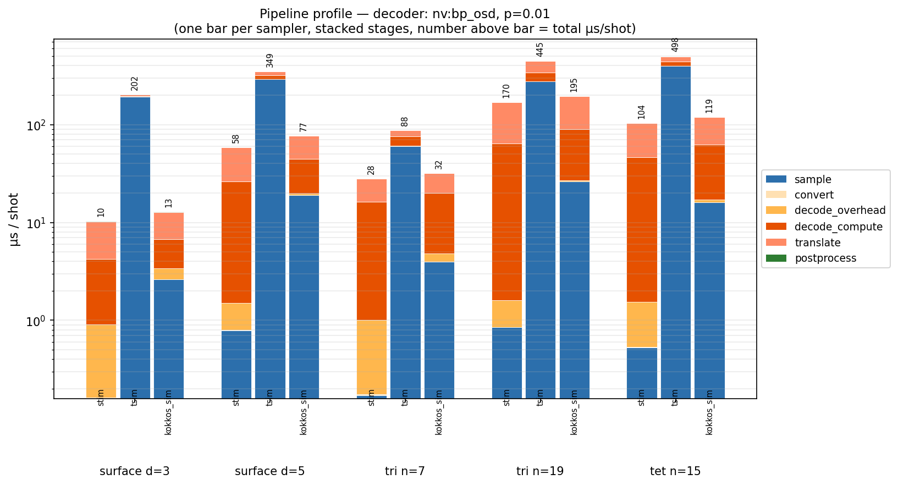
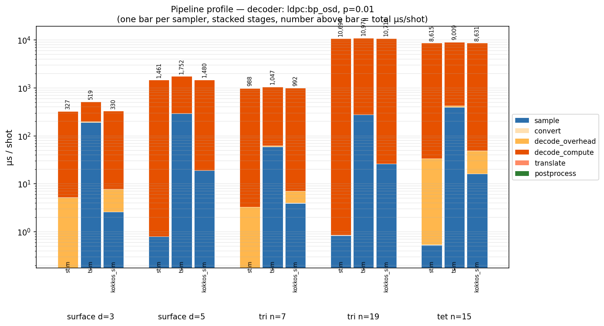

# ksim

ZX stabilizer-rank engine: symbolic **compile** + **sample** for Clifford and
non-Clifford (T-gate) circuits, on `pyzx_param`.

```
stim.Circuit
  → ksim.compile(...)          # parse → double → reduce → e→f basis,
                               #   components → plug → cat5 stabrank → emit
    → FlatProgram              # flat numpy IR — the contract between compile and sample
      → KokkosProgramSampler   # Kokkos runtime (CUDA on GPU builds, OpenMP on CPU)
      → sample_flat            # numpy reference (GPU-free)
```

Exact ℤ[ω] int64 arithmetic on device — amplitude error ~1e-16 vs float64
reference. One engine for Clifford and non-Clifford circuits alike.

## How it works

**stim** rests on Gottesman–Knill: a Clifford state is a stabilizer tableau,
every gate a row update — but a T gate conjugates a Pauli into a non-Pauli, so
the tableau has nowhere to put it. `ksim` changes representation: the circuit
(composed with its adjoint) becomes a **ZX-calculus diagram** reduced by
`pyzx_param`; T gates survive as π/4 phase spiders, and **stabilizer-rank
decomposition** replaces each magic-spider group by a sum of ≈2^{αt} stabilizer
terms (α<1 with cat-state strategies). Each output probability becomes an exact
closed-form sum with coefficients in the ring **ℤ[ω], ω = e^{iπ/4}**. Sampling
is autoregressive — one Bernoulli draw per output. Hardness is paid
exponentially in T-count, polynomially in everything else.

`ksim.compile` does the symbolic work in Python (on `pyzx_param`) and emits the
flat numpy `FlatProgram`; `kokkos_sim` uploads it once and runs the whole
autoregressive loop on GPU in int64 ℤ[ω] with power-of-2 renormalisation (or
`ksim.sample_flat` runs the same on CPU, GPU-free).

### Benchmark

All on an NVIDIA A100-SXM4-80GB; full data and method in [`docs/benchmarks.md`](docs/benchmarks.md).

**Sampler** — non-Clifford throughput and precision (5→1 magic-state distillation, 35k shots; µs/shot):

| | tsim (JAX/GPU) | clifft (CPU) | kokkos_sim (GPU) |
|---|---|---|---|
| distillation logical 5q (peak_rank 2) | — | **0.27** | ~1.0 |
| distillation encoded 85q | ~500 | ~100–10 000 | **~1.6** |
| amplitude deviation vs float64 | 2.7×10⁻⁸ | ~1×10⁻¹⁵ | **1.1×10⁻¹⁶** |

kokkos_sim and tsim run the same ZX stabilizer-rank sum, so both are exact — tsim just pays for storing ℤ[ω] integers in complex64 and driving the loop through XLA dispatch, which the fused int64 CUDA kernel avoids (~350× faster, 8 orders tighter precision). clifft is a different algorithm — a factored statevector, O(2^k) in the active dimension k — unbeatable at small peak_rank and the only one of the four with importance sampling for rare events, but its cost blows up as k grows with encoded T-gates, exactly where kokkos_sim's T-count scaling (χ ≈ 2^{0.228t}, not qubit count) wins and reaches circuits stim cannot express at all.

| amplitude precision | per-shot cost |
|---|---|
|  |  |

A closely related GPU non-Clifford simulator, [SOFT](https://arxiv.org/abs/2512.23037) (generalized stabilizer tableau), reports 6.68 µs/shot at d=3 and 93.7 µs/shot at d=5 magic-state cultivation on an H800 — the d=5 circuit (42 qubits) is out of statevector range entirely. These are cited from the paper, not re-run here (the dev cluster is CPU-only); a same-GPU kokkos_sim-vs-SOFT number is future work. Details in [`docs/benchmarks.md`](docs/benchmarks.md).

**Decoders** — `kokkos_decoder` matches the reference decoders' accuracy and is the fastest in the comparison (LER at p=0.01; decode µs/shot, total excl. sampling):

| code | best LER | kokkos:bp_osd | nv:bp_osd | ldpc:bp_osd |
|---|---|---|---|---|
| tri n=19 | 0.176 (relay) | **35 µs** | 169 µs | 10 693 µs |
| tet n=15 | **0.0135** (relay, 3.7× lower than bp_osd) | 27 µs | 103 µs | 8 615 µs |

`kokkos:bp_osd` predictions are bit-identical to `ldpc.BpOsdDecoder` at 2–5× nv's speed; `kokkos:relay_bp` matches or beats nv's Relay-BP on both accuracy and speed. The per-stage cost — kokkos pays a kernel-launch train, nv gives it back translating per-shot result objects, ldpc is pure CPU compute:

| kokkos:bp_osd | nv:bp_osd | ldpc:bp_osd |
|---|---|---|
|  |  |  |

The self-contained non-Clifford correctness gate (H·Tᵏ·H → exact P(1)) is in `tests/test_nonclifford.py`.

## Install

```bash
pip install -e .               # Python layer (numpy, stim, pyzx_param)
```

This repo also hosts the other two Kokkos/CUDA extensions used by the
`soft-info-code-switch` QEC pipeline — they share the same Kokkos build and
`src/cpp/` tree, so they live together here while their Python glue stays in
`soft-info-code-switch`:

| Extension | Imported as | Used by |
|-----------|-------------|---------|
| `kokkos_sim` | `import kokkos_sim` | `ksim.KokkosProgramSampler` (this package) |
| `kokkos_decoder` | `import kokkos_decoder` | `soft-info`'s `decode.decoders` (BP+OSD / Relay-BP / BP+LSD) |
| `kokkos_mcts` | `import kokkos_mcts` | `soft-info`'s `simulations/optimize_schedule.py` (needs MPI) |

The C++ backends are a separate CMake build (needs a Kokkos install). Without
them, `ksim.compile` and the numpy reference `ksim.sample_flat` still work; only
`KokkosProgramSampler` (and `sample_circuit(..., backend="gpu")`) require
`kokkos_sim`. All three `.so` install as top-level modules into `src/python/`,
so an editable install of this repo exposes them on the importer's path.

CPU and CUDA build recipes: [`docs/build.md`](docs/build.md). Rebuild all three
together, never just one: each statically links Kokkos, so mixing `.so` built
against different Kokkos installs in one process corrupts the shared runtime
state (segfault when the second extension is first used).

## Use

```python
import ksim

# one call: compile → draw noise → sample → (det, obs)
det, obs = ksim.sample_circuit(stim_text, n_shots, seed=42, backend="auto")

# or the explicit pieces (e.g. to reuse the compiled program):
flat, channel_probs, error_transform = ksim.compile(stim_text, sample_detectors=True)
ks = ksim.KokkosProgramSampler(flat)
f = ksim.ChannelSampler(channel_probs, error_transform, seed=42).sample(n_shots).astype("uint8")
out = ks.sample(f, seed=42)    # (B, n_outputs); det = out[:, :flat.num_detectors]
```

`example/sample_demo.py` runs this end to end (Clifford checked against stim, a
non-Clifford T circuit stim cannot touch, and the compile cache across a
p-sweep).

## Docs

| | |
|---|---|
| [`docs/architecture.md`](docs/architecture.md) | The `FlatProgram` contract, the compile and sample halves, the `kokkos_decoder`/`kokkos_mcts` APIs, and the C++ conventions all three extensions share |
| [`docs/build.md`](docs/build.md) | CPU (OpenMP) and CUDA build recipes, Kokkos reinstall, smoke test |
| [`docs/benchmarks.md`](docs/benchmarks.md) | Non-Clifford sampler deep dive (stim → tsim → kokkos_sim → clifft) and the decoder evolution log (kokkos vs nv-qldpc vs ldpc) |

Portions of the compile side are derived from Apache-2.0 third-party software —
see [`NOTICE`](NOTICE).
