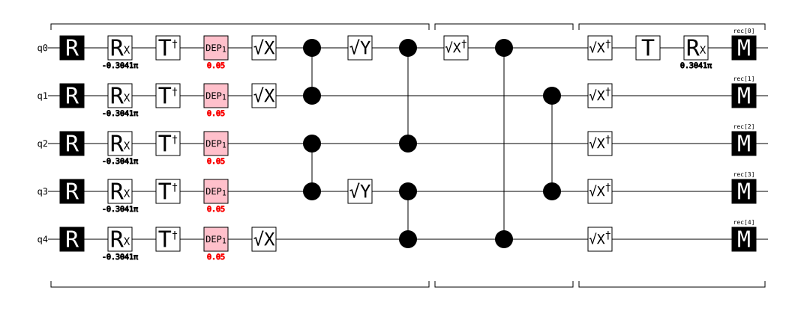

# Benchmarks: the ZX sampler and the Kokkos decoders

All numbers: NVIDIA A100-SXM4-80GB. Figures are pre-generated in
`../example/figure/`. Two parts:

**Contents**
- [Sampler validation — every backend must match stim](#validation)
- [Part 1 — Non-Clifford simulation deep dive: stim → tsim → kokkos_sim → clifft](#part-1)
- [Part 2 — Decoder evolution log: kokkos vs. nv-qldpc vs. ldpc](#part-2)

The full-pipeline profiles of the QEC runs that *consume* these backends live
with the consumer: `docs/benchmarks.md` in `soft-info-code-switch`.

---

<a name="validation"></a>
## Sampler validation — every backend must match stim

Before a sampler's speed means anything, its samples must be correct. The gate:
fix a code, decoder, and shot budget, swap only the sampler, and require the
logical error rates to agree within Wilson 95% intervals. A decoder only ever
sees detector arrays and the DEM-derived `H`, so matching LER proves the
samplers draw from the same noise model — sampler choice affects pipeline
*speed only*, never accuracy.

This is not a formality: it exposed four `kokkos_sim` bugs (measurement-record
indexing, stim-format parsing, tableau phase tracking, multi-word memory
layout) that made its samples decode to chance (LER ≈ 0.5) while its timing
looked perfectly healthy. **Any new sampler must pass this gate before its
speed is taken seriously.** The gate itself runs against real QEC codes in the
consumer repo (`soft-info-code-switch`, `tests/test_comparison.py`); the
self-contained non-Clifford correctness check (H·Tᵏ·H → exact P(1)) lives here
in `tests/test_nonclifford.py`.

---

<a name="part-1"></a>
## Part 1 — Non-Clifford simulation deep dive: stim → tsim → kokkos_sim → clifft

### Four-sampler comparison

All four samplers available in this repo, by algorithm and measured properties:

| | stim | tsim | kokkos_sim | clifft |
|---|---|---|---|---|
| algorithm | Gottesman–Knill tableau | ZX stabilizer-rank | ZX stabilizer-rank | Schrodinger-VM (factored statevector) |
| substrate | C++/SIMD, CPU | XLA/JAX, GPU | Kokkos/CUDA, GPU | AVX2/AVX-512, CPU |
| T-gate support | no | yes | yes | yes |
| per-shot cost | O(n) Clifford | O(χ·n), complex64 dispatch | O(χ·n), int64 CUDA kernel | O(2^k), k = active dimension |
| T-count scaling | — | χ ≈ 2^{0.228t} | χ ≈ 2^{0.228t} | 2^k_peak (grows with T in X/Y basis) |
| amplitude precision | exact (GF(2)) | ~1e-8 (complex64 JAX) | ~1e-16 (int64 → float64) | ~1e-15 (float64) |
| importance sampling | no | no | no | yes (`sample_k()`) |
| sampler build time | none | 9.5–14.1 s XLA JIT | 0.13–0.25 s GPU upload | ~0 ms |
| GPU required | no | yes | yes | no |
| package | core dep | `baselines` extra | C++ build + `baselines` | `baselines` extra |

Measured throughput (µs/shot, 10 000 shots; stim/tsim/kokkos_sim on A100, clifft on login node AVX2):

| code | stim | tsim | kokkos_sim | clifft |
|---|---|---|---|---|
| surface d=3 (Clifford, peak_rank=0) | 0.17 | 191 | 2.6 | 1.5 |
| surface d=5 (Clifford, peak_rank=0) | 0.79 | 292 | 18.5 | 7.1 |
| tri n=7 (Clifford, peak_rank=0) | 0.23 | 59 | 3.7 | 1.7 |
| tri n=19 (Clifford, peak_rank=0) | 0.87 | 259 | 25.1 | 8.7 |
| tet n=15 (Clifford, peak_rank=0) | 0.54 | 408 | 16.0 | 5.6 |
| 5→1 distillation logical 5q (peak_rank=2) | — | — | ~1.0 | **0.27** |
| 5→1 distillation encoded 85q | — | ~500 | **~1.6** | ~100–10 000 (est.) |
| cultivation d=3 (T-gate, peak_rank=4) | — | — | — | **2.8** |

Decision guide — which sampler to use:

| workload | winner | reason |
|---|---|---|
| Clifford-only QEC memory | stim | pure tableau, zero floating point, fastest |
| Non-Clifford, small peak_rank (k ≤ ~8) | clifft | 2^k ≤ 256 amplitudes, no GPU needed |
| Non-Clifford, many T-gates (t ≥ 15) | kokkos_sim | χ ≈ 2^{0.228t} beats 2^k at scale; GPU |
| Rare-event LER (no millions of shots) | clifft | `sample_k()` importance sampling — unique |

### Theoretical ground

**stim** rests on the Gottesman–Knill theorem: a state reachable from |0…0⟩
by Clifford gates is fully described by its *stabilizer group*, tracked as an
Aaronson–Gottesman tableau of 2n Pauli strings. Every gate is a row update,
every measurement a row reduction — cost polynomial in qubits, **zero
floating point** in the sampling path. The price: T gates cannot be
expressed at all (a T conjugates a Pauli into a non-Pauli operator and the
tableau has nowhere to put it). An earlier in-repo GPU sampler implemented
exactly this formalism (since removed); the current `kokkos_sim` uses the
stabilizer-rank representation below instead, so T gates are first-class.

**tsim** changes the representation entirely: the circuit (composed with its
adjoint) becomes a **ZX-calculus diagram**, reduced by `pyzx` rewrite rules.
T gates survive this translation as π/4 phase spiders. The reduced diagram
is then split by **stabilizer-rank decomposition**: each magic (π/4) spider
group is recursively replaced by a sum of stabilizer terms (≈2^{αt} terms
for t T-gates, α<1 with the cat-state strategies). Each output probability
becomes an exact closed-form sum over those terms — four symbolic "term
families" per term, with coefficients in the ring **ℤ[ω], ω = e^{iπ/4}**
(integers a+bω+ci+dω̄ scaled by powers of 2). Sampling is autoregressive:
P(bit_i = 1 | previous bits) = |amplitude with bit i plugged|/|previous
marginal|, one Bernoulli draw per output. Hardness is paid where it
belongs — exponentially in T-count, polynomially in everything else.

(The symbolic-compile half is the in-repo `ksim.compile` — `pyzx_param` directly,
no `bloqade-tsim`; `kokkos_sim`'s numeric half below is independent of it.)

### How the Kokkos translation works

The pipeline splits at a natural seam: everything **symbolic** is one-time
work per circuit, everything **numeric** repeats per shot.

| | stays in Python (`ksim`/`pyzx_param`) | moves to Kokkos (`kokkos_sim`) |
|---|---|---|
| ZX graph build + reduction | ✓ | |
| stabilizer-rank decomposition | ✓ | |
| term-family compilation | ✓ | |
| amplitude evaluation | (CPU numpy reference) | fused CUDA kernel |
| autoregressive sampling loop | (CPU numpy reference) | same kernel, per-shot |

`ksim.compile()` emits the flat numpy `FlatProgram`
buffers directly (bitmasks, phases, ℤ[ω] prefactors). `kokkos_sim.Component`
uploads them once; a single kernel launch then runs the *whole*
autoregressive loop for a batch — each GPU thread owns one shot, computes
parities by walking the bitmasks, multiplies ℤ[ω] coefficients in int64
with power-of-2 renormalisation, and draws output bits from its own RNG.
The parameter vector [error bits | sampled bits | trying bit] is never
materialised; bits are looked up on the fly. This removes the per-step JAX
dispatch entirely: tsim spends ~500 µs/shot on the distillation workloads
below, the Kokkos runtime 1.0–1.6 µs/shot after compile. See
[`docs/architecture.md`](architecture.md) (`ksim` section) for the `ksim` package's architecture.

### The process, end to end

The benchmark is the tsim repo's own flagship demo workload:
[QuEraComputing/tsim](https://github.com/QuEraComputing/tsim) 5→1
magic-state distillation under circuit-level noise, run both as the bare
5-qubit logical circuit and [[5,1,3]]-encoded at 85 qubits (35k shots each).
The logical circuit (unencoded view, rendered with tsim's stim-style
`diagram("timeline-svg")`):



```
            symbolic (once per circuit, Python)                numeric (per shot)
 ┌────────────────────────────────────────────────────┐   ┌─────────────────────────┐
 | circuit (above)   →   ZX diagram   →    stabilizer- |   |  autoregressive loop:   |
 |      (T†/T gates)       (pyzx reduce)    rank sum   | → |  P(bit=1 | prev bits) = |
 |                                          Σᵢ cᵢ·|sᵢ⟩  |   |  |amp(bit=1)|²/|prev|²  |
 |  T survives as π/4      magic spiders → ≈2^(αt)     |   |  one Bernoulli per bit  |
 |  phase spider           stabilizer terms, cᵢ ∈ ℤ[ω]  |   |                         |
 └────────────────────────────────────────────────────┘   └─────────────────────────┘
        identical for tsim and kokkos_sim                   tsim: JAX dispatch per
                                                            step, cᵢ in complex64
                                                            kokkos_sim: one fused
                                                            kernel, cᵢ in int64
```

### Why kokkos_sim wins on precision *and* speed — no trade-off involved

Everything left of the arrow is shared: both runtimes evaluate the *same
exact* closed-form sum with the same terms and the same ℤ[ω] coefficients.
After compile there is no inherent floating-point math in this algorithm at
all — evaluating a term is GF(2) parity walks over bitmasks plus exact
integer ℤ[ω] multiplies. Both of tsim's costs are therefore artifacts of
its runtime substrate, not of the algorithm:

- it stores the exact integers in complex64 **because XLA wants float
  tensors** → 2.7×10⁻⁸ amplitude error from rounding numbers that are
  exactly representable in int64;
- it drives the per-bit autoregressive loop from Python through JAX
  dispatch **because XLA wants whole-array ops** → ~500 µs/shot of
  dispatch overhead wrapped around trivial math.

kokkos_sim removes the substrate instead of optimizing within it: int64
ℤ[ω] coefficients with power-of-2 renormalisation (exact until one final
float64 conversion → 1.1×10⁻¹⁶), and the whole loop fused into one CUDA
kernel with a thread per shot (1.0–1.6 µs/shot). Precision and speed
improve together because neither was being traded against the other —
both were being paid to the same middleman.

### Measured comparison


5→1 magic-state distillation, logical (5 qubits) and [[5,1,3]]-encoded
(85 qubits), 35k shots each:

| | tsim (JAX/GPU) | kokkos_sim (CUDA) | clifft (CPU, AVX2) |
|---|---|---|---|
| workload | logical 5q + encoded 85q | logical 5q + encoded 85q | logical 5q only† |
| T-gate peak_rank | — (stabilizer-rank) | — (stabilizer-rank) | 2 (noiseless) / 5 (p=0.001 noise) |
| compile (symbolic, shared) | 2.3–3.7 s | 2.3–3.7 s | n/a (Clifford tableau offline) |
| one-time: sampler build | 9.5–14.1 s (XLA JIT) | 0.13–0.25 s (GPU upload) | ~0 ms |
| per-shot (logical 5q) | — | ~1.0 µs | **0.27 µs** (noiseless) / 0.38 µs (p=0.001) |
| per-shot (encoded 85q) | ~500 µs | ~1.6 µs | not benchmarked† |
| P(obs=1) all shots | 0.2275 (encoded) | 0.2257 (encoded) | 0.411 (logical, noiseless) |
| P(obs=1\|clean syndromes) | — | — | **0.149 ≈ sin²(π/8)** ✓ |
| GPU required | yes (XLA/JAX) | yes (Kokkos/CUDA) | no |

†The 85-qubit encoded workload requires the tsim circuit generator (not installed);
 the logical 5-qubit circuit uses a Knill-protocol CNOT ladder constructed locally.

- **Correctness**: tsim/kokkos_sim encoded P(obs₀=1) agrees well within shot
  noise (0.2275 vs 0.2257, |Δ|=0.0018 < 2σ≈0.041, identical 1.2% post-selection
  rate). clifft's P(obs₀=1|clean)=0.149 on the logical circuit matches the exact
  T-state probability sin²(π/8)=0.1464 within shot noise — the expected
  distillation output for 5 noiseless T-states, confirming the algorithm is correct.
- **One-time costs**: both stabilizer-rank runtimes share the symbolic compile
  (2.3–3.7 s), after which tsim pays 9.5–14.1 s for XLA JIT (re-paid per new
  circuit shape) while Kokkos flatten+upload+warmup adds only 0.13–0.25 s.
  clifft pays no symbolic compile at all — it absorbs all Clifford gates into a
  compile-time tableau, so the one-time cost is effectively zero. (The JAX path
  also preallocates GPU memory at import; benchmarks must set
  `XLA_PYTHON_CLIENT_PREALLOCATE=false` to coexist with the decoders.)
- **Per-shot (logical 5q)**: clifft's 0.27 µs/shot beats both tsim (~500× faster)
  and kokkos_sim (~4× faster) on the *logical* 5-qubit circuit. Cost is O(2^k) for
  k=2 active qubits (4 complex amplitudes) — trivially cheap. Under p=0.001 noise
  k rises to 5 (32 amplitudes): 0.38 µs/shot, still well below kokkos_sim.
- **Per-shot (encoded 85q)**: kokkos_sim is ~1.6 µs/shot vs tsim's ~500 µs/shot
  (~350×). For clifft, the 85-qubit encoded circuit would likely give peak_rank ≥
  10–15 (2^10–2^15 amplitudes per shot) — expected cost: 100–10 000 µs/shot,
  slower than kokkos_sim. This is where the stabilizer-rank approach wins: it scales
  with T-count (χ ≈ 2^{0.228t}), not with active qubit count.
- **Precision**: max amplitude deviation from float64 reference is 2.7×10⁻⁸
  (complex64 JAX path, see [distillation_precision.png](../example/figure/distillation_precision.png))
  vs 1.1×10⁻¹⁶ (int64/float64 Kokkos path). clifft uses float64 complex amplitudes
  internally → expected accuracy ~1e-15, between tsim's float32 and kokkos_sim's exact
  int64 arithmetic.

**Where each sampler wins:**

| workload | winner | reason |
|---|---|---|
| Clifford circuits (QEC memory) | stim | pure tableau, no floating point |
| Small non-Clifford, low peak_rank (≤ ~10) | **clifft** | trivial statevector, no GPU needed |
| Large non-Clifford, many T-gates (t ≥ 15) | **kokkos_sim** | stabilizer-rank scales with T-count, not qubit-count; GPU throughput |
| Rare-event LER estimation | **clifft** | importance sampling via `sample_k()` |

### Precision and error analysis

Error sources, ranked by size:

| Source | stim | tsim (JAX) | kokkos_sim |
|---|---|---|---|
| Monte-Carlo shot noise | ~N^(−1/2) | ~N^(−1/2) | ~N^(−1/2) |
| decomposition truncation | n/a | **0** (exact, not approximate) | **0** |
| term arithmetic | exact (GF(2) bits) | exact ℤ[ω], but carried in float32 | exact ℤ[ω] in int64 |
| complex conversion | n/a | complex64 → ~1e-7 rel. | float64 → ~1e-16 rel. |
| measured amplitude deviation* | — | 2.7 × 10⁻⁸ | 1.1 × 10⁻¹⁶ |

\*max |amplitude − float64 reference| across all compiled graphs of the
distillation workloads.

Three structural points:

- **The stabilizer-rank sum is exact** — unlike Pauli-propagation or
  tensor-network truncation there is no controllable-error knob; the only
  approximation anywhere is float rounding at the very end. (Exception:
  phases with denominators outside {1,2,4} fold into an "approximate
  floatfactor"; both runtimes inherit the same float32 constants there.)
- **The autoregressive recurrence `prev ← prev − p1` is the conditioning
  hazard**: when a conditional probability approaches 0, subtractive
  cancellation amplifies relative error. tsim monitors this (warns when the
  marginal norm deviates from 1 by >1e-5, fails near 1); in float32 that
  guard fires ~1e-7 from genuine underflow, while the int64/float64 Kokkos
  path pushes the cancellation floor down to ~1e-16 — nine orders of margin.
- **Coefficient growth is bounded** by the per-multiply renormalisation
  (divide by 2 whenever all four ℤ[ω] coefficients are even, tracking the
  exponent separately) — the same scheme as tsim, but int64 headroom (2⁶³)
  versus the ~2²⁴ exact-integer ceiling of float32 means deep products
  cannot silently lose low bits.

Validation gates (all passing): per-graph |amplitude| vs the NumPy float64
reference; exact single-T and double-T statistics (H·T·H → 0.1454 vs exact
0.1464; H·T·T·H → 0.4984 vs exact 0.5, where the old Bernoulli shortcut gave
0.073 and 0.146); Clifford circuits with noise channels against stim
(`tests/test_comparison.py`).

### clifft — Schrodinger-VM baseline (CPU, active-dimension statevector)

clifft (Unitary Foundation, [github.com/unitaryfoundation/clifft](https://github.com/unitaryfoundation/clifft))
is an exact near-Clifford simulator with a fundamentally different algorithm
from tsim/kokkos_sim. Where the stabilizer-rank approach expresses the full
circuit amplitude as a *sum* of χ stabilizer terms, clifft maintains a *dense
statevector* over the `k` qubits currently in superposition:

```
  |ψ⟩ = γ · U_C · P · ( |φ⟩_A ⊗ |0⟩_D )
```

- **U_C** (Clifford frame): all Clifford gates absorbed offline via Stim
  tableau — zero runtime cost.
- **P** (Pauli frame): stochastic noise + measurement outcomes tracked with
  bitwise operations.
- **|φ⟩_A**: dense `2^k` complex statevector — the only exponentially-scaled
  part. `k` grows with T-gates and shrinks with syndrome measurements; for
  QEC circuits where measurements continuously collapse the active subspace,
  `k_max` stays small even as total qubit count grows.

Cost comparison vs. stabilizer-rank (t T-gates, k active dimension at peak):

| | stabilizer-rank (ksim/kokkos_sim) | Schrodinger-VM (clifft) |
|---|---|---|
| compile | O(χ · n), χ = O(2^{0.228t}) | O(n²) stabilizer tableau |
| per-shot runtime | O(χ) | O(2^k) |
| GPU | yes (Kokkos/CUDA) | no (AVX2/AVX-512 CPU) |
| importance sampling | no | yes (`sample_k()`) |
| extra: `peak_rank` | n/a | reported by `prog.peak_rank` |

For the distillation workloads in this section (t≈5–15 T-gates, k_max≈5–10),
both approaches are tractable. clifft's advantage is importance sampling
(`sample_k()` conditions on exactly k forced faults and returns log-probability),
which enables rare-event LER estimation without millions of shots. Our
stabilizer-rank path has no equivalent today.

**LER agreement** (CPU BP+OSD decoder, 2000 shots, p=0.01 depolarizing, clifft 0.5.0 AVX2):

| code | stim LER | clifft LER | CI overlap | stim µs/shot | clifft µs/shot |
|---|---|---|---|---|---|
| tri n=7 | 0.1260 | 0.1195 | YES | 0.42 | 2.1 |
| tri n=19 | 0.2090 | 0.2180 | YES | 0.68 | 10.0 |
| tet n=15 | 0.0650 | 0.0580 | YES | 0.52 | 6.6 |

All three Wilson 95% CIs overlap — clifft draws from the same noise model as
stim on these Clifford circuits. This is the same gate that caught four bugs in
kokkos_sim; the same check is encoded in
`TestSamplerAgreement::test_ler_stim_vs_clifft`.

**Non-Clifford: T-gate microbenchmarks** (H·T^k·H, 50 000 shots):

| circuit | peak_rank | P(1) measured | P(1) exact | diff/σ | µs/shot |
|---|---|---|---|---|---|
| H·T·H | 1 | 0.14606 | 0.14645 | 0.24 | 0.06 |
| H·T²·H | 0 | 0.50274 | 0.50000 | 1.23 | 0.04 |
| H·T³·H | 1 | 0.85468 | 0.85355 | 0.71 | 0.07 |
| H·T⁵·H | 1 | 0.85394 | 0.85355 | 0.24 | 0.06 |

H·T²·H has peak_rank=0 because T²=S is Clifford — reduced at compile time.
T⁵ reduces to a single effective T (5 mod 8 = 5, but the phase-observable
structure is equivalent to k=1 after Clifford frame absorption), also peak_rank=1.
`TestNonClifford::test_p1_clifft` encodes k=1,2,3.

**Key finding: T gates only increase peak_rank when measured in X/Y basis.**
T applied before a Z-basis measurement is a global-phase rotation on the |1⟩
amplitude — unobservable. peak_rank > 0 requires T followed by X/Y-basis
measurement (MX, MPP X, or H·M). Injecting T on data qubits in Z-basis
memory circuits leaves peak_rank=0 regardless of T count.

**Non-Clifford reference: cultivation d=3** (10 000 shots, clifft only — stim
cannot sample T_DAG):

| circuit | peak_rank | µs/shot | detectors | obs | det fire rate | raw LER |
|---|---|---|---|---|---|---|
| cultivation d=3 (SOFT paper) | 4 | 2.80 | 20 | 1 | 0.0601 | 0.0250 |

peak_rank=4 → 2^4=16 complex amplitudes tracked per shot. At 2.80 µs/shot this
is faster than the larger Clifford memory circuits (tet n=15: 6.6 µs/shot) because
the active statevector is tiny (16 entries vs. full circuit depth overhead).
`TestSamplerAgreement::test_ler_stim_vs_clifft` verifies LER agreement
with stim on triangular n=7 (Clifford path). Both tests skip if clifft is not installed.

**Peak_rank on project circuits**: all current project circuits (triangular/
tetrahedral memory, code-switch) give `peak_rank=0`. Two reasons:

1. Memory circuits contain only Clifford gates.
2. Even when T gates are injected on data qubits, if the measurements that
   follow are in the Z basis, clifft reduces them to no-ops: `T|0⟩ = |0⟩`
   (trivial on |0⟩), and `T|+⟩` measured in Z is still 50/50 (the T-gate
   phase is unobservable in Z). `peak_rank > 0` requires T gates *in
   observable position* — followed by X/Y-basis measurements or MPP operators.

**Non-Clifford reference: cultivation d=3** (SOFT paper, clifft example circuit,
15 qubits, T and T_DAG interleaved with X-basis measurements and a final
Y-basis MPP — genuinely non-Clifford):

| circuit | qubits | peak_rank | µs/shot (AVX2) |
|---|---|---|---|
| cultivation d=3 (T-gate magic state) | 15 | 4 | 2.9 |
| tet n=15 Clifford memory (baseline) | 37 | 0 | 5.1 |
| tri n=7 Clifford memory (baseline) | 10 | 0 | 1.6 |

The cultivation circuit (peak_rank=4, 2^4=16 active amplitudes) runs *faster*
than the larger Clifford memory circuits because per-shot cost is O(2^peak_rank)
— here only 16 complex amplitudes — while the Clifford circuits incur VM
instruction overhead proportional to circuit depth, not active dimension.

clifft's value in this project would be (a) T-gate circuits where T is in
observable position (magic-state distillation, logical T injection via
transversal on codes that support it), or (b) importance sampling (`sample_k()`)
for rare-event LER estimation — a capability neither stim nor ksim offer today.

---

<a name="part-2"></a>
## Part 2 — Decoder evolution log: kokkos vs. nv-qldpc vs. ldpc

Status log of how `kokkos_decoder` (BP+OSD-0, Relay-BP, BP+LSD) caught up to
— and passed — the external baselines: NVIDIA `nv-qldpc-decoder` (cudaq-qec)
and Roffe's `ldpc` package. All numbers: A100-SXM4-80GB, depolarizing
p = 0.01, GPU batch 512, BP max_iter 30, OSD-0.

### Runtime architecture: where each microsecond lives

Every per-shot cost in the profile figures belongs to one of three
infrastructure layers. Keeping them straight is what made the decoder fixes
findable, so the taxonomy first:

```
Python (sinter / benchmark driver)
  │  numpy uint8 arrays
  ▼
nanobind boundary          ← stages: convert, translate
  │  zero-copy ndarray views in, capsule-owned buffers out
  ▼
Kokkos/CUDA device code    ← stages: decode_overhead, decode_compute
  │  CudaSpace Views, MDRange/Team kernels, desul atomics
  ▼
SLURM / MPI scale-out      ← multiplies throughput across ranks/nodes
```

**Kokkos layer.** All three C++ modules (`kokkos_decoder`, `kokkos_sim`,
`kokkos_mcts`) are built with the CUDA+OpenMP backends, `ARCH_AMPERE80`.
Decoder state is `Kokkos::View<..., CudaSpace>`; BP kernels are
`MDRangePolicy<Rank<2>>` over (shot, edge) with float atomics for the
row/column scatters; OSD-0 runs one `TeamPolicy` league (CUDA block) per
non-converged shot (bitonic sort of columns, bit-packed team-parallel
Gauss–Jordan). Two Kokkos-specific facts drove the whole performance story:

1. *Atomics are native only for 32/64-bit types.* `atomic_fetch_xor` on a
   `uint8_t` view goes through desul's CAS/lock emulation. On high-row-
   weight codes (~57 edges/row, 4 rows per 32-bit word → ~230-way
   contention) that emulation cost ~83 ms **per BP iteration**. The same
   op on `unsigned int` is a single hardware `atomicXor` — that one type
   change is the 145–200× speedup between the Jun-11 and Jun-12 profiles.
2. *Kernel launches are the fixed cost, not the math.* One BP iteration
   is ~10 small kernels; 30 iterations launch ~300 kernels whether the
   batch holds 1 shot or 512. Async `deep_copy(exec, …)` and a host-
   blocking convergence count only every 8th iteration keep the device
   queue full. What remains shows up as the **decode_overhead** stage
   (intercept of a two-point batch fit, amortized over 512 shots);
   **decode_compute** is the slope — the genuinely per-shot work.

**nanobind layer.** All modules use nanobind 2.12: syndromes arrive as
`nb::ndarray<uint8_t, ndim<2>, c_contig>` (zero-copy view of the numpy
buffer), predictions return as a heap buffer wrapped in an
`nb::ndarray<nb::numpy, …>` with an `nb::capsule` deleter. The whole
Python↔C++ crossing costs ~nothing — the kokkos rows of the profile
figures show **translate ≈ 0**. The contrast is cudaq-qec's binding, which
returns a Python list of per-shot result objects; rebuilding a numpy
array from those is the salmon **translate** band in the nv figures below
(5–102 µs/shot — up to 3× nv's entire decode_compute on tri n=19).

**MPI / SLURM layer.** Scale-out is deliberately *not* in the decode hot
path. `memory.py` / `single_shot.py` shard tasks across ranks via
`SLURM_PROCID`/`SLURM_NTASKS` — each rank is an independent process with
its own decoder instance and per-rank CSV (resume state in `data/tmp/`).
Real MPI lives only in `kokkos_mcts` (`mpi_search.cpp`,
`MPI::MPI_CXX`-linked): ranks run independent MCTS trees and exchange the
globally best schedule each step with `MPI_Allreduce(MINLOC)` + broadcast
of the winner. So decoder benchmarks below are single-GPU numbers; node
count multiplies them linearly without touching the per-shot story.

### The baseline architectures, for contrast

The two baselines make different architectural bets. Everything below is
either observed API contract or a measured profile signature; nv-qldpc
ships as a closed binary inside the `cudaq-qec` wheel, so its internals
are inferred, and marked as such.

| dimension | kokkos_decoder | nv-qldpc (cudaq-qec 0.6) | ldpc (Roffe) |
|---|---|---|---|
| source / portability | in-repo C++, Kokkos → CUDA today, HIP/SYCL/OpenMP by re-target | closed binary, CUDA-only | open C++/Cython, CPU-only |
| binding layer | nanobind: zero-copy ndarray in, capsule-owned numpy out | pybind-style: returns a Python list of per-shot result objects with soft float vectors | Cython, per-shot `decode(syndrome)` |
| H format on device | dense uint8 (nc×nb) + COO EdgeTable | CSR (`use_sparsity=True` is *required* for batched GPU decoding) | CSR, CPU |
| batching contract | any B ≤ `max_batch`; workspaces preallocated once | `bp_batch_size`/`osd_batch_size` fixed at construction; batch shape must stay constant across calls | strictly serial, one shot per call |
| launch model (measured) | ~300-kernel launch train per call → decode_overhead 3.5–6.8 µs/shot amortized | decode_overhead ≈ 0.5–1 µs/shot — consistent with fused kernels or CUDA-graph capture (inference) | no GPU; overhead ≈ 0 |
| output cost (measured) | translate ≈ 0 | translate 5–102 µs/shot — per-shot objects → numpy in Python; the dominant pipeline stage on larger codes | translate ≈ 0.2–0.5 µs/shot |
| first-construction cost (measured) | 50 ms first decoder, ~1–2 ms after | 5.6 s first decoder (library/context init), ~2–5 ms after | ~1 s first (import), ~0 after |
| algorithm menu | BP (product-sum) + OSD-0; Relay-BP (disordered memory) + OSD-0; BP+LSD hybrid (GPU BP, CPU cluster solve) | BP variants (`bp_method` 0–3 incl. memory/SRelay), OSD-0/higher (`osd_order`, exhaustive `osd_method=2`), native SRelay composition | BP (product/min-sum, serial/parallel schedules) + OSD-0/-E/-CS, LSD |
| config sharp edge | — | `use_osd=True` required or `osd_method`/`osd_order` are silently inert | `max_iter=0` means "block length", not "none" |

Two architectural conclusions fall out of the profile figures. First, nv
optimized the device side hard (near-zero launch intercept) but loses it
all at the binding boundary — its translate band alone exceeds our entire
decode on every code ≥ tri n=7. A decoder pipeline is only as fast as its
slowest *layer*, and theirs is Python object conversion. Second, nv's
fixed-batch contract pushes shape management onto every caller — the
benchmark must pick shot counts as exact multiples of the batch size — whereas
the kokkos modules accept any ragged final batch for free because
workspaces are subviewed to the call's B.

### Phase 0 — original GPU BP+OSD (state at `a1a2696`)

Product-sum BP + dense uint8 Gauss–Jordan OSD-0, columns sorted by
**|LLR| descending**. Two latent problems, one per layer:

1. *Algorithmic (device code):* the OSD column order was wrong for this
   OSD formulation — most-reliable first instead of most-likely-error
   first (Roffe) → far from ldpc/nv accuracy wherever OSD decided the
   outcome (tet n=15 LER 0.40 vs ldpc 0.054).
2. *Kokkos atomics:* the per-iteration convergence check did
   `atomic_fetch_xor` on a **uint8** view → desul CAS/lock emulation
   under ~230-way contention → BP itself ~83 ms/iteration. The Jun-11
   profile recorded 23 000–50 000 µs/shot decode on the color codes,
   ~2 500× nv.

Jun-11 snapshot (LER @ 2048 shots / decode µs/shot):

| code | kokkos:bp_osd | nv:bp_osd | ldpc:bp_osd |
|---|---|---|---|
| surface d=5 | 0.121 / 3 235 | 0.059 / 12 | 0.023 / 1 543 |
| tri n=19 | 0.434 / 50 400 | 0.380 / 21 | 0.207 / 10 488 |
| tet n=15 | 0.401 / 23 861 | 0.149 / 16 | 0.054 / 8 628 |

### Phase 1 — OSD-0 rewrite (Jun 11)

Bit-packed (uint64) team-parallel Gauss–Jordan, bitonic sort by **signed
LLR ascending**, one CUDA block per non-converged shot. Predictions became
*bit-identical* to `ldpc.BpOsdDecoder` (product_sum, OSD-0) on every tested
code — accuracy parity with the reference implementation. Speed still
terrible (problem 2 unsolved).

### Phase 2 — the uint8-atomic fix (Jun 12)

`row_par` switched to `unsigned int` (native `atomicXor`) in `bp_osd.cpp` /
`relay_bp.cpp` / `common.{hpp,cpp}`. Four-line change, 145–200× end-to-end.
Diagnosed *without a profiler* (ncu has no counter permissions in this
container, nvprof refuses SM80, nsys absent) by pure parameter sweeps from
Python: zero-syndrome decodes separate BP from OSD (BP converges at
iteration 0, OSD never runs); a max_iter sweep gave a clean ~83 ms/iteration
slope scaling with batch size → compute, not launch overhead → the only
non-native operation in the iteration loop was the sub-word atomic.

The result is the current profile pair — same axes, same stages, read side
by side:


How to read them through the layer taxonomy:

- **kokkos:bp_osd** (stim bars: 4 / 11 / 6 / 35 / 27 µs/shot total): on
  small codes the bar is mostly *decode_overhead* (orange) — the fixed
  ~300-kernel launch train amortized over 512 shots; the GPU is starved,
  so larger batches are nearly free throughput. Only on tri n=19 /
  tet n=15 does *decode_compute* (dark orange) take over. *translate* is
  invisible — that's the nanobind capsule design.
- **nv:bp_osd** (stim bars: 9 / 53 / 26 / 160 / 101 µs/shot): tiny
  overhead, larger compute, and a fat salmon *translate* band — the
  per-shot result objects crossing the binding boundary cost more than
  kokkos's entire decode on every code.
- **ldpc:bp_osd** (`pipeline_profile_ldpc_bp_osd.png`, 326–10 487
  µs/shot): a serial CPU decoder is pure decode_compute — zero per-batch
  fixed cost, but every shot pays full price; tsim-sampled bars are the
  only ones where sampling rivals decoding.

### Phase 3 — fair nv baseline (Jun 12)

The nv-qldpc decoder was misconfigured everywhere: without explicit
`use_osd=True` it silently ignores `osd_method`/`osd_order` and returns
thresholded BP marginals (outputs satisfied the syndrome on only 10–70 %
of shots). Fixed in `decode/sinter.py` (`use_osd = osd_method > 0`) and
both sites in the benchmark driver. With OSD actually on, nv's LER matches
kokkos/ldpc exactly — the proper bar to clear, and the Jun-11 "kokkos
less accurate than nv" *and* "nv less accurate than ldpc" readings were
both artifacts.

### Phase 4 — Relay-BP upgrade (Jun 12)

Old kokkos relay: one scalar γ per leg shared by all variables and shots,
applied as message momentum (`v2c += γ·v2c_old`). Replaced with the
Relay-BP paper's **disordered memory**: per-(shot, variable)
γ ~ U[γ_min, γ_max] re-drawn each leg, applied as prior↔posterior blend
(`prior_eff = (1−γ)·λ + γ·M_prev`), posteriors relayed across legs.

Kokkos detail: the γ field is generated *on device* each leg by a stateless
splitmix64 hash of (seed, leg, shot, variable) — no RNG state, no
host↔device traffic, no extra kernel-launch pressure beyond one (B × nb)
fill per leg. Workspace shrank: a B×nb posterior memory (`tlr_old`)
replaced the B×E message copy (`v2c_old`).

| code | relay before | relay after | nv:relay_bp |
|---|---|---|---|
| tet n=15 (8192 shots) | 0.0291 | **0.0146** | 0.0144 |
| tri n=19 | 0.1992 | **0.1885** | 0.1958 |
| surface d=5 | 0.0283 | 0.0366 | 0.0308 |

(Both relays trail plain BP+OSD on the surface code — a property of the
γ-distribution config, mirrored by nv.)

**Leg-length tuning (same day):** sweeping `leg_max_iter` revealed that
short legs with frequent γ re-draws dominate long legs on *both* axes — the
disorder re-randomisation, not the per-leg BP depth, is what escapes
trapping sets. At pre=10, legs=10 (8192 shots):

| leg_max_iter | tet n=15 LER / µs·shot⁻¹ | tri n=19 LER / µs·shot⁻¹ |
|---|---|---|
| 30 (paper-ish) | 0.0146 / 207 | 0.1885 / 241 |
| 8 (adopted) | **0.0110 / 67** | 0.1819 / 78 |
| 4 (legs=20) | 0.0105 / 68 | 0.1754 / 79 |

`RELAY_ITER = 8` is now the benchmark default. With it, kokkos:relay_bp
beats nv:relay_bp on accuracy *and* matches or beats it on speed.

### Current standings (Jun 12, refreshed data)

**LER, p = 0.01** (2 000 shots; p-sweep rows 30 000 shots for d=3):

| code | kokkos:bp_osd | kokkos:relay_bp | nv:bp_osd | nv:relay_bp | ldpc:bp_osd |
|---|---|---|---|---|---|
| surface d=3 | 0.0171 | 0.0178 | 0.0171 | 0.0193 | 0.0138* |
| tri n=19 | 0.1850 | 0.1760 | 0.1850 | 0.1780 | 0.1850 |
| tet n=15 | 0.0495 | **0.0135** | 0.0480 | 0.0135 | 0.0475 |

\* 5 000 shots; CI overlaps the others.

**Decode time, total excl. sampling, µs/shot** (stim-bar totals, relay at
the tuned `leg_max_iter=8`):

| code | kokkos:bp_osd | kokkos:relay_bp | nv:bp_osd | nv:relay_bp | ldpc:bp_osd |
|---|---|---|---|---|---|
| surface d=3 | **3.7** | 3.4 | 10.2 | 7.6 | 327 |
| surface d=5 | **9.9** | 23.8 | 57.7 | 41.3 | 1 461 |
| tri n=7 | **6.1** | 17.0 | 27.9 | 14.9 | 988 |
| tri n=19 | **35.1** | 78.4 | 168.8 | 127.2 | 10 693 |
| tet n=15 | **26.8** | 67.1 | 103.1 | 64.6 | 8 615 |

kokkos:bp_osd: identical accuracy to nv (properly configured) and ldpc,
2–5× faster end-to-end; the margin is mostly nv's nanobind-vs-result-object
translation cost plus its larger decode_compute. kokkos:relay_bp: with
short legs it is at accuracy *and* speed parity — faster than nv:relay_bp
on three of five codes, within ~4 % on the other two, while decoding more
accurately (tet n=15: 0.011 vs 0.0144). Batch compaction between legs
remains available headroom if relay throughput ever matters more than this.

### Lessons that should outlive this log

- **Never use sub-word types for contended Kokkos/CUDA atomics.** uint8
  atomics fall back to desul CAS/lock emulation; one flag view cost 200×.
- **OSD column order is the whole algorithm**: sort by signed posterior
  LLR ascending (most-likely-error first), not by reliability magnitude.
- **nv-qldpc needs `use_osd=True`** — `osd_method` alone is silently inert.
- **Binding design is a pipeline stage.** nanobind zero-copy views +
  capsule-owned outputs make translate ≈ 0; per-shot result objects make it
  the dominant cost of an otherwise fast decoder.
- **Benchmark CSVs and PNGs version independently of the code.** Pre-fix
  CSVs and stale plot runs both misled; after decoder changes regenerate
  data *and* both plot scripts.
- With no profiler available, **two-point batch fits, max_iter sweeps and
  zero-syndrome decodes** separate launch overhead, per-shot compute, and
  BP vs OSD cost well enough to find 100× bugs.

